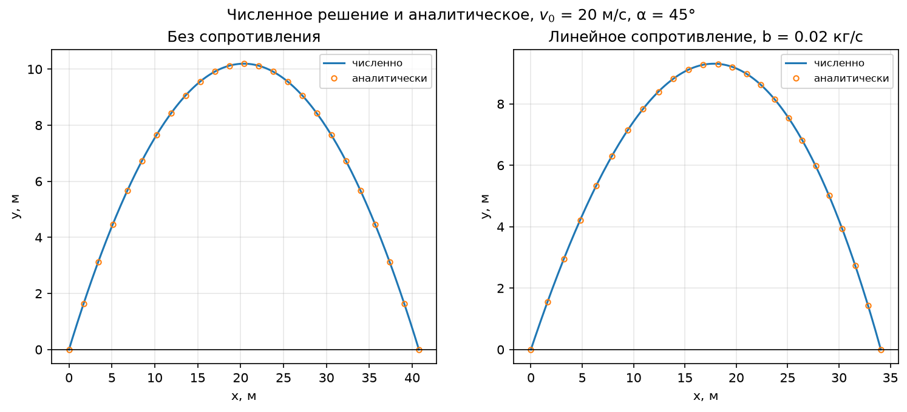
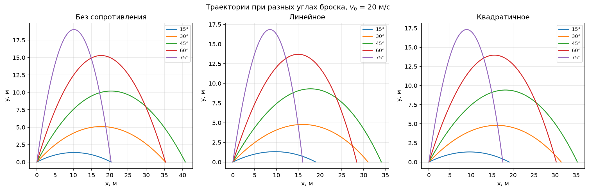
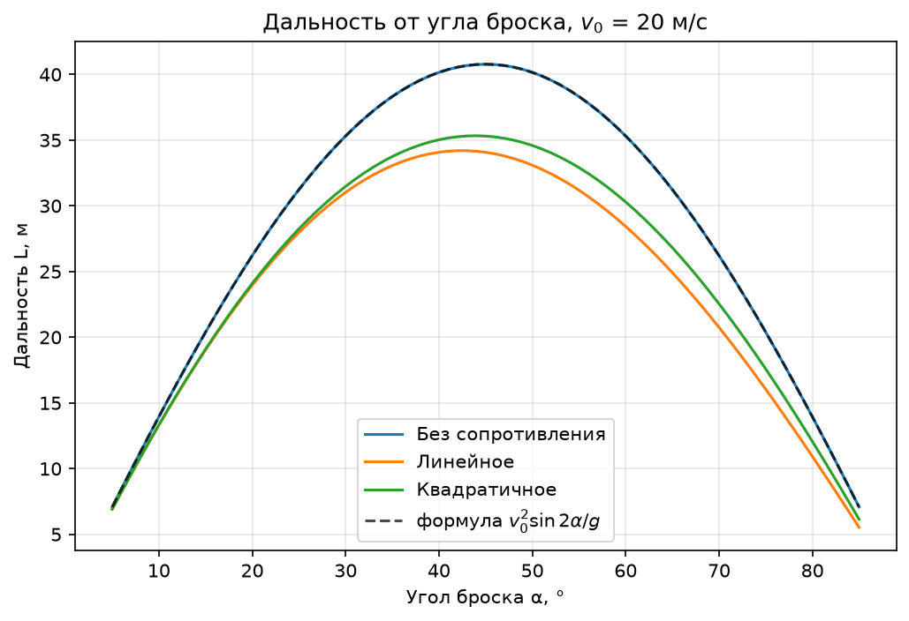
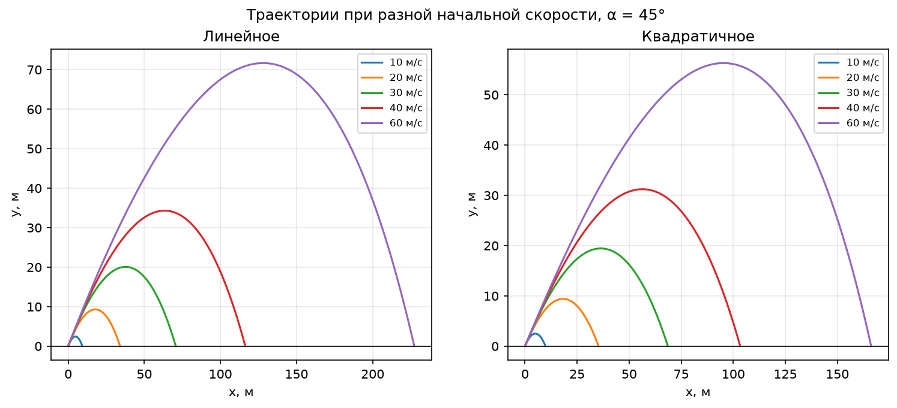
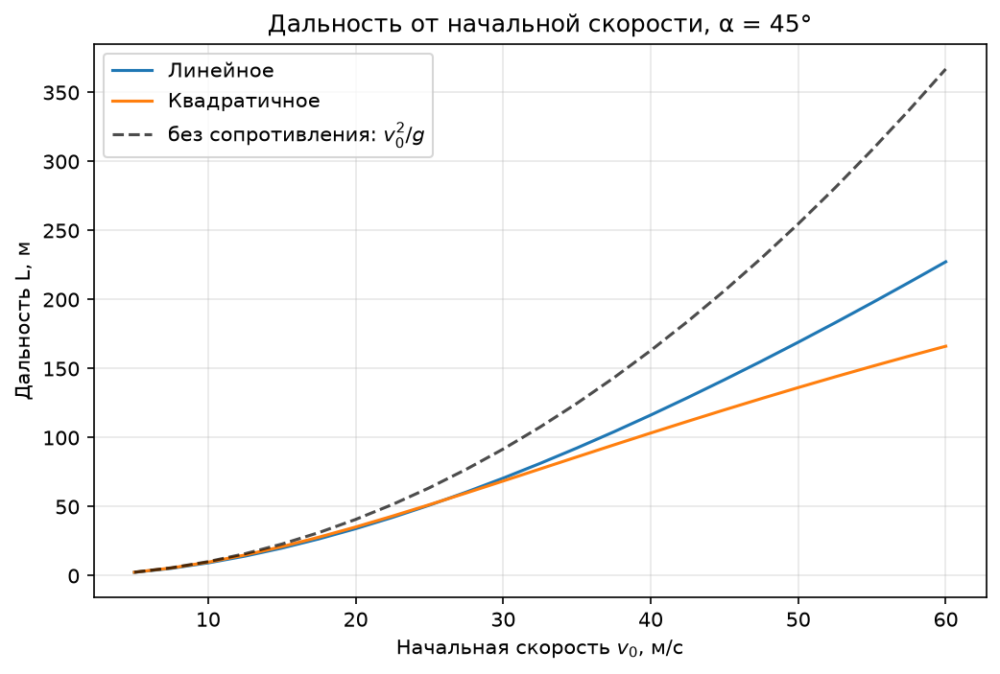
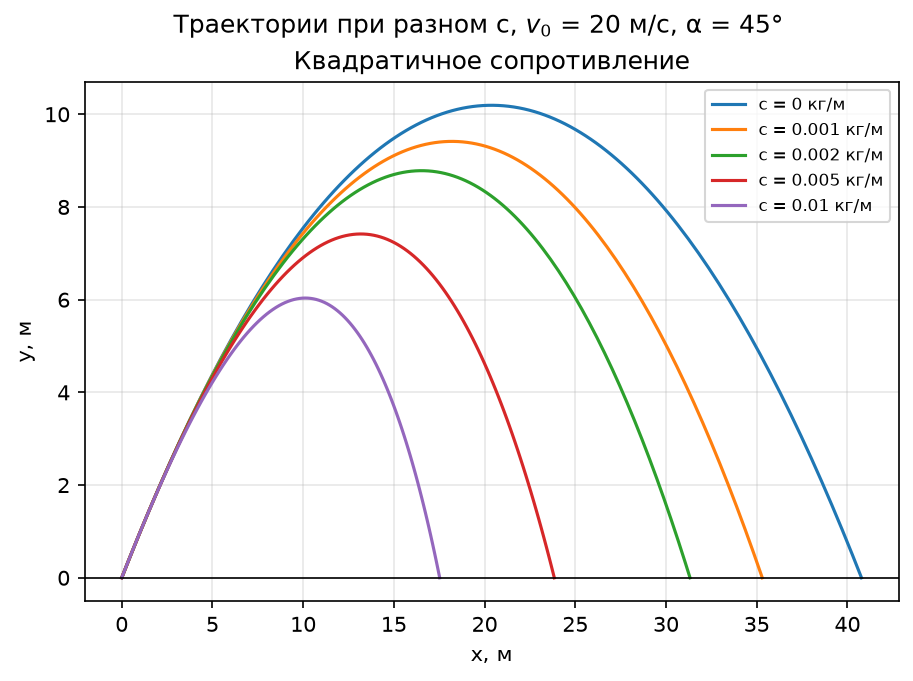
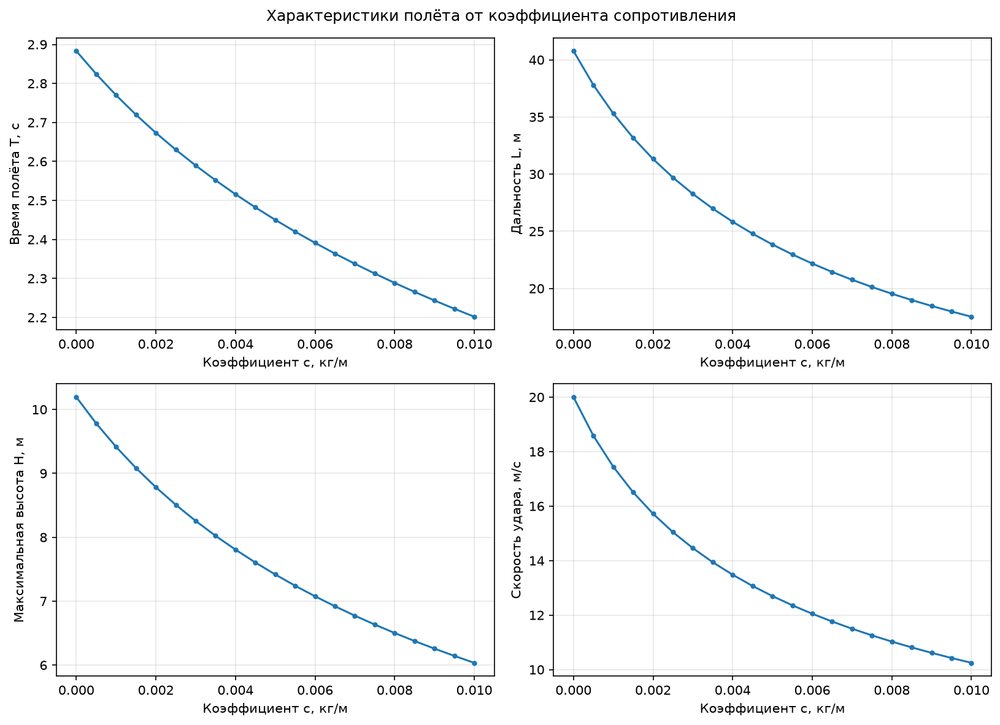

# Полёт камня с сопротивлением воздуха

Все числа и графики воспроизводятся командой `python -m src.experiments`.

## 1. Модель

Камень массой $m$ брошен с земли со скоростью $v_0$ под углом $\alpha$.
Материальная точка, $g$ постоянно, ветра нет, движение в плоскости, земля —
$y = 0$.

Уравнения движения:

$$\dot x = v_x, \qquad \dot y = v_y, \qquad
m \dot v_x = -F_x, \qquad m \dot v_y = -mg - F_y$$

$$x(0) = 0, \quad y(0) = 0, \quad v_x(0) = v_0 \cos\alpha, \quad v_y(0) = v_0 \sin\alpha$$

Три модели силы сопротивления, $|v| = \sqrt{v_x^2 + v_y^2}$:

| Модель | $\vec F$ | $\dot v_x$ | $\dot v_y$ |
|---|---|---|---|
| Без сопротивления | $0$ | $0$ | $-g$ |
| Линейная | $b\,\vec v$ | $-\frac{b}{m} v_x$ | $-g - \frac{b}{m} v_y$ |
| Квадратичная | $c\,\lvert v\rvert\,\vec v$ | $-\frac{c}{m}\lvert v\rvert\, v_x$ | $-g - \frac{c}{m}\lvert v\rvert\, v_y$ |

Параметры: $m = 0.2$ кг, $g = 9.81$ м/с², $v_0 = 20$ м/с, $\alpha = 45°$,
$b = 0.02$ кг/с, $c = 0.001$ кг/м. Размерности $b$ и $c$ разные, поэтому они
подобраны из равенства начальных сил: $b v_0 = c v_0^2 = 0.4$ Н, что
составляет $0.2\,mg$.

## 2. Аналитические решения

**Без сопротивления:**

$$x = v_0 \cos\alpha \cdot t, \qquad y = v_0 \sin\alpha \cdot t - \frac{g t^2}{2}$$

$$T = \frac{2 v_0 \sin\alpha}{g}, \qquad
L = \frac{v_0^2 \sin 2\alpha}{g}, \qquad
H = \frac{v_0^2 \sin^2\alpha}{2g}, \qquad
v_\text{кон} = v_0$$

**Линейное сопротивление**, $\gamma = b/m$ — уравнения для $x$ и $y$
независимы и решаются точно:

$$v_x = v_{0x} e^{-\gamma t}, \qquad
v_y = \Big(v_{0y} + \frac{g}{\gamma}\Big) e^{-\gamma t} - \frac{g}{\gamma}$$

$$x = \frac{v_{0x}}{\gamma}\big(1 - e^{-\gamma t}\big), \qquad
y = \frac{1}{\gamma}\Big(v_{0y} + \frac{g}{\gamma}\Big)\big(1 - e^{-\gamma t}\big) - \frac{g t}{\gamma}$$

Время полёта находится из трансцендентного уравнения $y(T) = 0$ и в
элементарных функциях не выражается.

**Квадратичное сопротивление:** уравнения для $v_x$ и $v_y$ связаны через
$|v|$, аналитического решения нет — только численное.

## 3. Численный метод

Система интегрируется `scipy.integrate.solve_ivp` (Рунге — Кутта 4(5)),
`rtol = 1e-9`, `atol = 1e-11`, шаг не больше 0.02 с. Два события:
$y = 0$ останавливает счёт и даёт $T$ и $L$; $v_y = 0$ даёт точную высоту $H$.
Код — `src/solver.py`.

## 4. Сверка с аналитикой



Без сопротивления, базовый бросок:

| Величина | Формула | Численно | Отн. погрешность |
|---|---|---|---|
| $T$, с | 2.883208 | 2.883208 | 6.7e-16 |
| $L$, м | 40.774720 | 40.774720 | 2.8e-15 |
| $H$, м | 10.193680 | 10.193680 | 2.2e-16 |
| $v_\text{кон}$, м/с | 20.000000 | 20.000000 | 4.4e-16 |

Вдоль траектории и по сериям расчётов:

| Проверка | Макс. отклонение |
|---|---|
| Линейная модель, $x(t)$ | 1.8e-14 м |
| Линейная модель, $y(t)$ | 8.9e-14 м |
| Линейная модель, $\vec v(t)$ | 1.3e-14 м/с |
| Вакуум, $L(\alpha)$ при $\alpha = 5…85°$ против $v_0^2 \sin 2\alpha / g$ | 6.7e-15 (отн.) |
| Вакуум, $L(v_0)$ при $v_0 = 5…60$ м/с против $v_0^2 / g$ | 6.7e-15 (отн.) |

Расхождение на уровне машинной точности. Для вакуума точное решение —
многочлен второй степени, который метод четвёртого порядка воспроизводит
точно; для линейной модели $\gamma h = 0.1 \cdot 0.02 = 0.002$, и ошибка
метода $\sim (\gamma h)^5$ пренебрежимо мала. Квадратичная модель считается
тем же интегратором; её точность проверена сходимостью при уменьшении шага
(`tests/test_solver.py`).

## 5. Эксперименты

В каждой серии меняется один параметр, остальные — базовые. Измеряются
время полёта $T$, дальность $L$, максимальная высота $H$ и скорость удара
$v_\text{кон}$.

| Серия | Параметр | Модели |
|---|---|---|
| Угол | $\alpha = 5…85°$, шаг 1° | все три |
| Скорость | $v_0 = 5…60$ м/с, шаг 2.5 м/с | линейная, квадратичная, формула $v_0^2/g$ |
| Сопротивление | $c = 0…0.01$ кг/м, шаг 0.0005 | квадратичная |

## 6. Результаты

Базовый бросок:

| Модель | $T$, с | $L$, м | $H$, м | $v_\text{кон}$, м/с |
|---|---|---|---|---|
| Без сопротивления | 2.883 | 40.77 | 10.19 | 20.00 |
| Линейная | 2.757 | 34.07 | 9.31 | 16.78 |
| Квадратичная | 2.770 | 35.31 | 9.41 | 17.44 |

### 6.1 Угол броска




| $\alpha$ | $v_0^2 \sin 2\alpha / g$ | Без сопр. | Линейная | Квадратичная |
|---|---|---|---|---|
| 15° | 20.39 | 20.39 | 19.04 | 19.09 |
| 30° | 35.31 | 35.31 | 31.03 | 31.48 |
| 45° | 40.77 | 40.77 | 34.07 | 35.31 |
| 60° | 35.31 | 35.31 | 28.43 | 30.29 |
| 75° | 20.39 | 20.39 | 16.04 | 17.58 |
| max $L$ при | 45° | 45° | 42° | 44° |

- Без сопротивления траектория — симметричная парабола, $L(\alpha) = L(90° - \alpha)$,
  максимум при 45°.
- С сопротивлением симметрия пропадает: нисходящая ветвь короче и круче,
  дополнительные углы неравноценны (60° летит ближе 30°), максимум
  дальности смещается ниже 45°.

### 6.2 Начальная скорость




| $v_0$, м/с | $v_0^2/g$, м | $L$ лин., м | $L$ квадр., м | Потеря лин., % | Потеря квадр., % |
|---|---|---|---|---|---|
| 10 | 10.19 | 9.29 | 9.81 | 8.9 | 3.8 |
| 20 | 40.77 | 34.07 | 35.31 | 16.4 | 13.4 |
| 30 | 91.74 | 70.67 | 68.60 | 23.0 | 25.2 |
| 40 | 163.10 | 116.37 | 103.34 | 28.7 | 36.6 |
| 60 | 366.97 | 227.37 | 166.21 | 38.0 | 54.7 |

- Без сопротивления $L \propto v_0^2$; с сопротивлением рост медленнее, и
  отставание от $v_0^2/g$ растёт со скоростью.
- Модели меняются местами: при малых скоростях сильнее тормозит линейная, при
  больших — квадратичная. Причина: при выбранных коэффициентах
  $F_\text{квадр} / F_\text{лин} = c v / b = v / (20\ \text{м/с})$, то есть
  квадратичная сила больше линейной только при $v > 20$ м/с.

### 6.3 Коэффициент сопротивления




| $c$, кг/м | $c v_0^2 / mg$ | $T$, с | $L$, м | $H$, м | $v_\text{кон}$, м/с |
|---|---|---|---|---|---|
| 0 | 0.00 | 2.883 | 40.77 | 10.19 | 20.00 |
| 0.001 | 0.20 | 2.770 | 35.31 | 9.41 | 17.44 |
| 0.002 | 0.41 | 2.673 | 31.32 | 8.78 | 15.72 |
| 0.005 | 1.02 | 2.450 | 23.84 | 7.42 | 12.70 |
| 0.01 | 2.04 | 2.202 | 17.53 | 6.04 | 10.25 |

- Все четыре характеристики монотонно убывают. При $c = 0.01$ от вакуумных
  значений остаётся 43% дальности, 51% скорости удара, 59% высоты и 76%
  времени полёта: сильнее всего страдает дальность, слабее всего — время.
- Значения $c \gtrsim 0.002$ кг/м для камня нефизичны: сила сопротивления
  сравнима с весом. Они взяты для наглядности.

## 7. Выводы

1. Численное решение совпадает с аналитическим для вакуума и линейной модели
   с точностью $\sim 10^{-14}$, поэтому результатам для квадратичной модели,
   посчитанной тем же методом, можно доверять.
2. Без сопротивления траектория симметрична, $L = v_0^2 \sin 2\alpha / g$,
   максимум при 45°, $v_\text{кон} = v_0$.
3. Сопротивление делает траекторию несимметричной и сдвигает угол
   наибольшей дальности ниже 45° (42° для линейной, 44° для квадратичной при
   базовых параметрах).
4. Влияние квадратичного сопротивления быстро растёт со скоростью: потеря
   дальности 3.8% при 10 м/с и 54.7% при 60 м/с.
5. Линейную и квадратичную модели можно сравнивать только по силам. Если
   силы равны при скорости $v_*$ (здесь $v_* = 20$ м/с), то при $v < v_*$
   сильнее тормозит линейная, при $v > v_*$ — квадратичная.

## 8. Как воспроизвести

```bash
python -m src.experiments   # графики в docs/plots/ и таблицы в stdout
python -m pytest            # тесты
```
